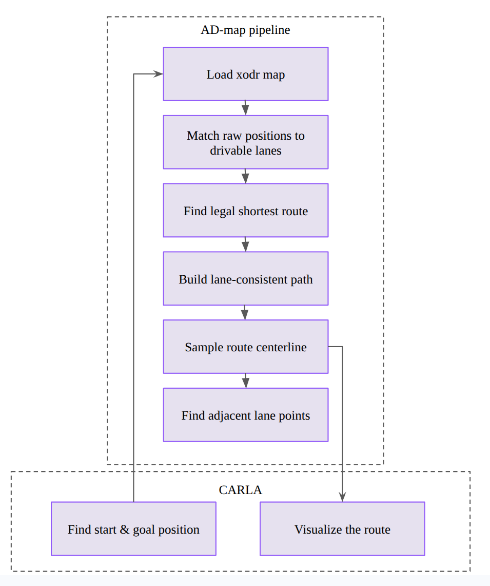
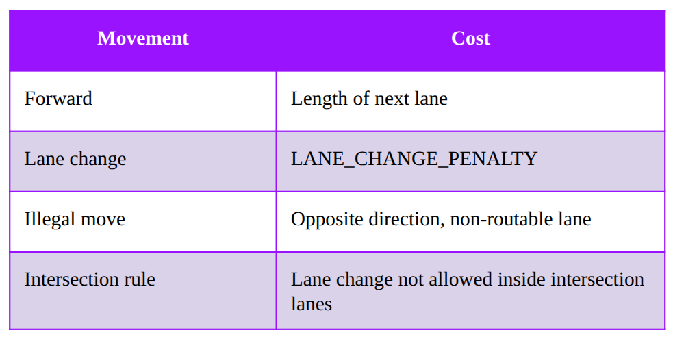
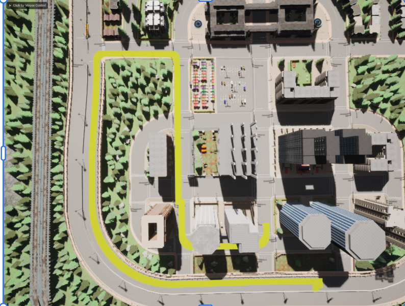

# Custom_global_planner

This project finds the shortest driving route from a raw start object position to a raw goal object position using the AD-map stack. The planner core is CARLA-independent. CARLA is only used by the optional demo utilities to read the `start_1` and `goal_1` object positions from the world and to draw the final route back into the simulator.

The route search, lane matching, lane-direction handling, centerline sampling, lane cache building, and adjacent-lane lookup are done outside CARLA with the AD-map libraries and the custom routing code in this repo.

## 1. What this project uses

This project uses the CARLA AD-map repository:

- [carla-simulator/map](https://github.com/carla-simulator/map)

In this repo, that dependency is expected inside the `map_repo/` folder, and its build output must already exist under:

```bash
map_repo/install/
```

The `map_repo/` folder in this project contains that repository:

- [carla-simulator/map](https://github.com/carla-simulator/map)

## 2. Project architecture

The architecture used in this project is shown below.



## 3. Short project flow

1. CARLA finds the raw positions of `start_1` and `goal_1`.
2. The OpenDRIVE map is loaded from the selected `maps/*.xodr` file.
3. AD-map matches the raw positions to nearby drivable lanes.
4. The matched positions are snapped to the closest points on nearby lane centers.
5. The first run saves an AD-map cache plus a Python lane cache for later reuse.
6. A custom shortest-path search uses lane connectivity from `map_repo` to build a legal lane-by-lane route.
7. Only forward lane continuation and same-direction lane changes are allowed while building the route.
8. The final route is sampled into CARLA-format points for downstream use and optional visualization.
9. CARLA draws the final route for visualization when the demo script is used.

## 4. Route cost model

The custom global planner uses a lane-level graph search with a simple custom cost design.

- Forward movement cost = length of the next lane
- Lane-change cost = fixed `LANE_CHANGE_PENALTY`
- Illegal moves are ignored from the graph
- Lane changes inside intersection lanes are blocked

The current movement-cost summary is shown below.



In practice, this means the planner prefers shorter legal forward progress, while lane changes are only taken when their fixed penalty still leads to a lower total route cost.

## 6. Repository layout

```text
.
├── maps/
│   └── *.xodr
├── global_planner/
│   ├── admap_backend.py
│   ├── cache.py
│   ├── geometry.py
│   ├── planner.py
│   ├── route.py
│   ├── runtime.py
│   └── waypoint.py
├── examples/
│   └── carla/
│       ├── carla_bridge.py
│       ├── common.py
│       └── run_map_test.py
├── map_repo/
├── cache/
└── temporary/
```

## 7. Main files

- `global_planner/planner.py`: public `GlobalPlanner` API and custom lane-level routing logic
- `global_planner/waypoint.py`: waypoint wrapper with `left()`, `right()`, `next()`, and `previous()`
- `global_planner/cache.py`: cache metadata and Python cache file management
- `global_planner/runtime.py`: automatic AD-map runtime bootstrap for direct Python imports
- `examples/carla/run_map_test.py`: optional CARLA-backed demo runner for testing and drawing
- `examples/carla/carla_bridge.py`: optional CARLA helper for object lookup and route drawing

## 8. Requirements

The planner core uses only the Python standard library plus this runtime dependency:

- `ad_map_access`

They are listed in [requirement.txt](requirement.txt).

Notes:

- `ad_map_access` comes from the built [carla-simulator/map](https://github.com/carla-simulator/map) repo.
- `carla` is only needed for the optional demo files under `examples/carla/`.

## 9. Before you run the optional CARLA demo

Make sure these items are ready first:

1. CARLA is installed and the server can run.
2. The town loaded in CARLA matches the OpenDRIVE map you want to use.
3. In your map two objects (cube) named `start_1` and `goal_1` are available.
4. The `map_repo` dependency is built, and `map_repo/install/` exists.
5. The CARLA Python environment exists.

For the optional CARLA demo, update the local hard-coded paths if your machine is different:

- `examples/carla/run_map_test.py`
  - `XODR_PATH`
  - `CARLA_PYTHON`
- `examples/carla/carla_bridge.py`
  - `CARLA_ROOT`

## 10. How to use the planner directly

You can use the planner directly from Python without sourcing `activate.sh`, because the package now prepares the AD-map runtime automatically.

Example:

```bash
python - <<'PY'
from global_planner import GlobalPlanner

planner = GlobalPlanner("maps/Town10HD_Opt.xodr", cache_root="cache")
planner.load()
route = planner.trace_route(
    {"x": -86.8, "y": 133.5, "z": 0.0},
    {"x": 59.4, "y": 137.8, "z": 0.0},
)
print(route.length_m)
planner.close()
PY
```

If the AD-map install is not in the default sibling path `map_repo/install`, pass `ad_map_install_root=...` to `GlobalPlanner(...)` or set `GLOBAL_PLANNER_AD_MAP_INSTALL`.

## 11. Optional CARLA demo

If you still want visualization in CARLA, run:

```bash
python examples/carla/run_map_test.py
```

The script will:

1. read the raw `start_1` and `goal_1` object positions
2. load the OpenDRIVE map
3. reuse or rebuild the planner cache
4. compute the route with the custom AD-map-based lane search
5. sample route points
6. draw the planner route plus snapped start and goal points in CARLA

## 12. Example commands

```bash
cd ~/Desktop/Custom_global_planner
python examples/carla/run_map_test.py
```

## 13. Output

During a normal run, the project prints information such as:

- CARLA start and goal object positions
- snapped start and goal lane information
- route length
- number of sampled route points
- lane count in the chosen route
- cache-backed planner status

Temporary JSON outputs are written into the `temporary/` folder.




## 14. Important note about shortest-path routing

This project still uses `map_repo` for:

- loading the OpenDRIVE map
- lane matching
- lane geometry
- lane direction
- lane-to-lane connectivity
- adjacent lane lookup

But the final shortest-path search is custom in this repo. It does **not** rely on `ad.map.route.planRoute()` for the final path anymore.
