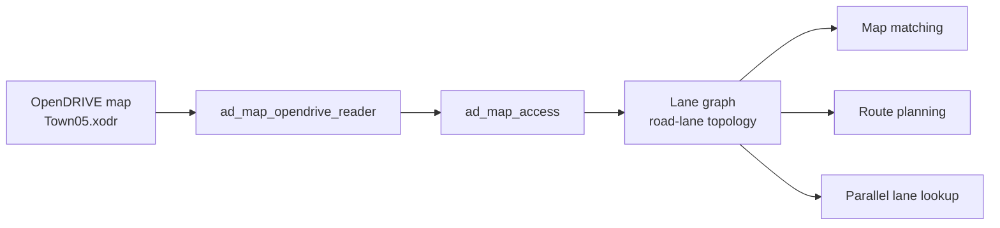
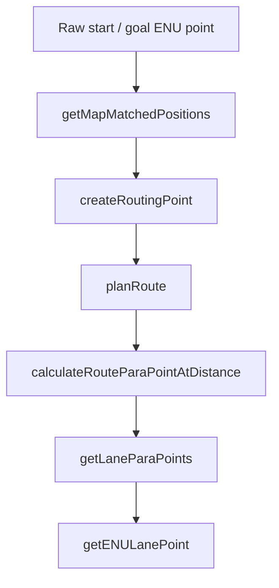
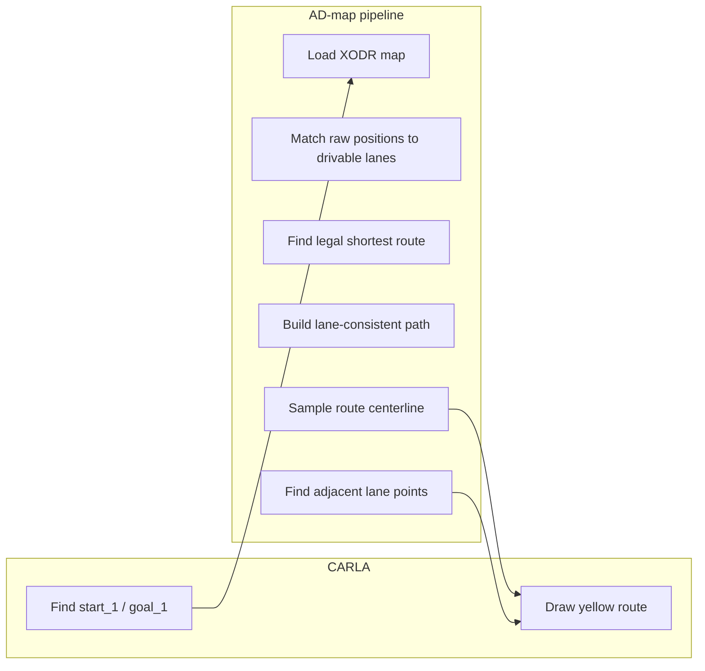
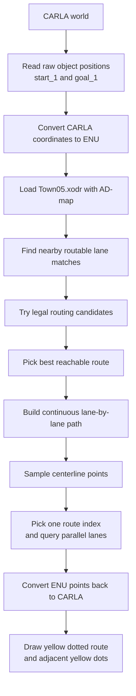
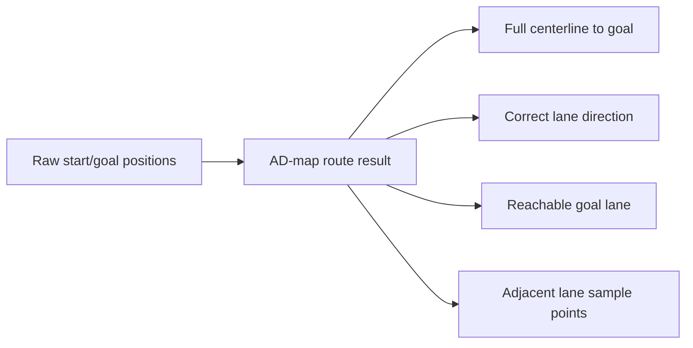

# AD Map Project Overview

- `map_repo` is the AD-map stack used as the routing core in this project.
- It reads OpenDRIVE (`.xodr`) maps and builds lane-level road geometry.
- It provides map matching, lane connectivity, route planning, and lane-neighbor queries.
- It does not need CARLA to parse the map or compute the route.
- In this project, it is the engine used to turn raw start/goal positions into a legal lane-following path.

---

# AD-map Functions Used In This Project

- Map load and cleanup
  - `ad.map.access.initFromOpenDriveContent(...)`: load the `.xodr` map into AD-map
  - `ad.map.access.cleanup()`: clear the loaded map from memory
- Lane and road information
  - `ad.map.lane.getLanes()`: get all parsed lanes
  - `ad.map.lane.getLane(...)`: get one lane by lane id
  - `ad.map.lane.isRouteable(...)`: check whether the lane can be used for routing
  - `ad.map.lane.isLaneDirectionPositive(...)`: check legal forward direction
  - `ad.map.lane.isLaneDirectionNegative(...)`: check legal reverse direction
- Position matching
  - `ad.map.match.AdMapMatching().getMapMatchedPositions(...)`: find nearby lane matches for raw start/goal positions
  - `ad.map.match.isActualWithinLaneMatch(...)`: prefer matches that are truly inside the lane
- Route planning and route sampling
  - `ad.map.route.createRoutingPoint(...)`: convert a matched lane point into a routing input
  - `ad.map.route.planRoute(...)`: compute the legal route between start and goal
  - `ad.map.route.calcLength(...)`: get route length
  - `ad.map.route.getRouteParaPointFromParaPoint(...)`: place the matched start on the route
  - `ad.map.route.calculateRouteParaPointAtDistance(...)`: sample along the route by distance
  - `ad.map.route.getLaneParaPoints(...)`: get all parallel lane positions at one route sample
  - `ad.map.lane.getENULanePoint(...)`: convert a lane-parametric point to real ENU coordinates
- Point and parameter types
  - `ad.map.point.ENUPoint`, `ad.map.point.ENUCoordinate`
  - `ad.map.route.RouteParaPoint`, `ad.map.route.RoutingDirection.POSITIVE`, `ad.map.route.RoutingDirection.NEGATIVE`
  - `ad.physics.Distance`, `ad.physics.Probability`, `ad.physics.ParametricValue`

---

# Modification 1: Clear Task Split

- CARLA is used only for two tasks:
  - read the raw positions of `start_1` and `goal_1`
  - draw the final route and helper dots
- Everything else was moved to the AD-map side:
  - map loading
  - lane matching
  - shortest-path search
  - lane direction checking
  - continuous lane-path selection
  - adjacent-lane point lookup

---

# Modification 2: Step-by-Step Runtime Flow

- Main runner: `scripts/run_map_test.py`
- CARLA-only bridge: `scripts/carla_bridge.py`
- Routing and lane logic: `scripts/admap_route.py`

---

# Modification 3: Important Fixes That Made It Work

- The goal could be wrong when the wrong CARLA object or wrong snapped position was used.
  - Fix: read the raw `goal_1` object position directly and pass that into AD-map routing.
- The route could stop early before the destination.
  - Fix: sample along the selected lane path up to the final route position and append the true end point when needed.
- The route could ignore lane direction or jump onto a lane that was not actually reachable.
  - Fix: build a continuous lane-by-lane path and reject route candidates whose last lane cannot reach the matched goal lane.
- Parallel lane access was not visible in the output.
  - Fix: query left/right neighbor lanes from the routed segment and draw their sample points too.

